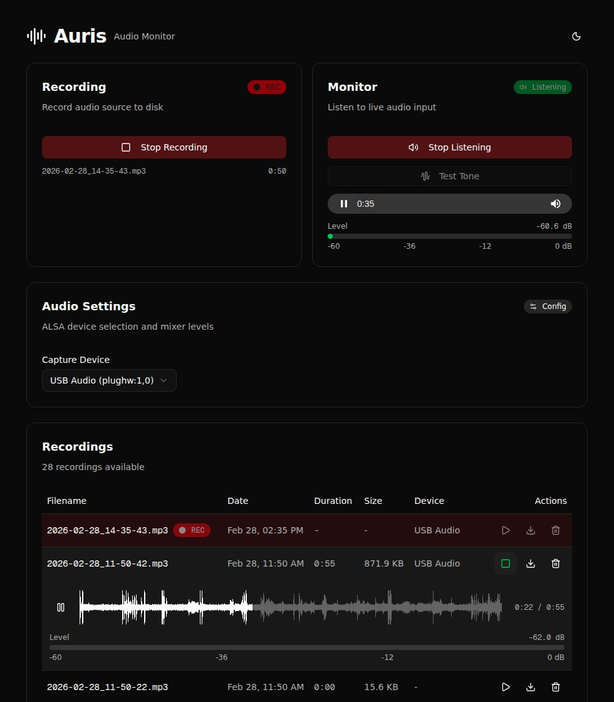

# Auris

Audio monitoring and recording web application. Streams live audio via Icecast2 and records to disk, controlled through a Next.js web UI.



## Architecture

```
Browser  ──>  Nginx (:80/:443)  ──>  Next.js (:3075)   ── API ──>  systemctl start/stop
                   │                     │                              │
                   │                     │ SQLite DB               auris-capture
                   │                     │ (recording metadata)    (single ffmpeg process)
                   │                     │                              │
                   └── /stream/ ───>  Icecast2 (:8000)  <───────────────┘
                                                                        │
                                                                  Audio Source
                                                                 (ALSA capture)
```

- **Next.js** (app router, TypeScript, Tailwind, shadcn/ui) — web UI + API routes
- **SQLite** (better-sqlite3, Drizzle ORM) — recording metadata and device info
- **Icecast2** — audio streaming server (localhost only, proxied by Nginx)
- **ffmpeg** — captures ALSA audio for streaming and/or recording
- **systemd** — manages the capture process (`auris-capture` service)
- **Nginx** — reverse proxy under a single hostname
- **PM2** — process manager for the Next.js production server

A single `auris-capture` service runs one ffmpeg process. State flags in `/etc/default/auris` (`CAPTURE_STREAM`, `CAPTURE_RECORD`) control whether ffmpeg outputs to Icecast, a recording file, or both. Toggling stream/record restarts the service with updated outputs (~1s dropout).

## Quick setup

There's an automated setup script that handles everything except Nginx and PM2:

```bash
git clone https://github.com/deviationist/auris.git && cd auris
npm run setup
```

This will:
- Install system packages (`ffmpeg`, `icecast2`)
- Symlink the project to `/opt/auris`
- Create recordings directory and SQLite data directory
- Install `/etc/default/auris` config file
- Install Icecast2 config
- Install systemd unit and sudoers
- Build the Next.js app

After running the script, follow the printed "Next steps" to configure the ALSA device and start PM2/Nginx.

## Manual setup

### Prerequisites

- Ubuntu 22.04+ (or any systemd-based Linux)
- Node.js 20+ and npm
- A USB microphone (tested with Jabra Speak PHS002W)

```bash
sudo apt update
sudo apt install -y ffmpeg icecast2 nginx
npm install -g pm2
```

### 1. Clone and install

```bash
git clone https://github.com/deviationist/auris.git
cd auris
npm install

# Symlink to /opt/auris (systemd units and PM2 reference this path)
sudo ln -sf "$(pwd)" /opt/auris

# Create recordings directory (or configure RECORDINGS_DIR in .env.local)
sudo mkdir -p /recordings
sudo chown $(whoami):$(whoami) /recordings

# Create SQLite data directory
mkdir -p data
```

### 2. Find your ALSA device

Plug in your USB microphone/input device and identify it:

```bash
arecord -l
```

Example output:
```
card 1: Audio [USB Audio], device 0: USB Audio [USB Audio]
```

This means the device is `plughw:1,0`. You can select it from the web UI (Audio Settings > Capture Device) after setup.

### 3. Configure system

```bash
# Install config file
sudo cp /etc/default/auris.example /etc/default/auris  # or create manually
# Edit /etc/default/auris to set ALSA_DEVICE, RECORDINGS_DIR, etc.

# Install Icecast config
sudo cp system/icecast.xml /etc/icecast2/icecast.xml
sudo systemctl enable icecast2
sudo systemctl restart icecast2
```

Default Icecast credentials (change in `system/icecast.xml` if needed):
- Source password: `sourcepass`
- Admin password: `adminpass`

### 4. Install systemd unit and sudoers

```bash
# Install the capture service
sudo cp system/auris-capture.service /etc/systemd/system/
sudo systemctl daemon-reload

# Install sudoers (replace "trym" with your username)
# The setup script does this automatically
sudo cp system/auris-sudoers /etc/sudoers.d/auris
sudo chmod 440 /etc/sudoers.d/auris
sudo visudo -c   # must print "parsed OK"
```

### 5. Build and start with PM2

```bash
npm run build
pm2 start ecosystem.config.js
pm2 save
pm2 startup   # follow the printed command to enable on boot
```

### 6. Configure Nginx (optional)

If you want to access the app via a hostname like `mic.trym` on port 80:

```bash
sudo cp system/nginx-auris.conf /etc/nginx/sites-available/auris
sudo ln -sf /etc/nginx/sites-available/auris /etc/nginx/sites-enabled/
sudo nginx -t
sudo systemctl reload nginx
```

Add the hostname to DNS or `/etc/hosts` on machines that need to reach it:
```
192.168.x.x  mic.trym
```

Without Nginx, the app is available directly at `http://<server>:3075`.

### 7. Verify

1. Open the web UI in a browser
2. Click **Start Recording** — the badge should turn red and a REC indicator appears in the recordings table
3. Click **Listen** — you should hear live audio
4. Stop recording, then check the **Recordings** table for duration and size
5. Play or download a recording to verify

## Development

```bash
npm run dev                    # starts Next.js on port 3000 with hot reload
npm run build                  # production build
npm run start                  # production server
npm run stop                   # kill process on port 3000
npm run db:generate            # generate DB migrations after schema changes
npm run db:push                # push schema directly to DB (dev only)
npm run waveforms:generate     # generate missing waveforms
npm run waveforms:regenerate   # regenerate all waveforms
npm run waveforms:clear        # remove all waveforms from DB
```

The API routes will work in dev mode as long as the systemd unit and sudoers are installed.

## File layout

```
auris/
├── src/
│   ├── app/
│   │   ├── page.tsx                    # Main dashboard UI
│   │   ├── layout.tsx                  # Root layout (ThemeProvider)
│   │   ├── globals.css                 # Tailwind + shadcn/ui theme (light/dark)
│   │   └── api/
│   │       ├── status/route.ts         # GET  — stream/record status
│   │       ├── stream/
│   │       │   ├── start/route.ts      # POST — start streaming
│   │       │   ├── stop/route.ts       # POST — stop streaming
│   │       │   └── test-tone/route.ts  # POST — send 440Hz test tone
│   │       ├── record/
│   │       │   ├── start/route.ts      # POST — start recording (inserts DB row)
│   │       │   └── stop/route.ts       # POST — stop recording (updates DB row)
│   │       ├── recordings/
│   │       │   ├── route.ts            # GET  — list recordings from DB
│   │       │   └── [filename]/route.ts # GET  — stream file, DELETE — remove
│   │       └── audio/
│   │           ├── devices/route.ts    # GET  — list ALSA capture devices
│   │           ├── device/route.ts     # POST — select capture device
│   │           └── mixer/route.ts      # GET/POST — read/set mixer levels
│   ├── components/
│   │   ├── ui/                         # shadcn/ui components (do not edit)
│   │   ├── level-meter.tsx             # WebAudio RMS/dB level meter
│   │   ├── waveform-player.tsx         # Canvas waveform player with seek, play/pause
│   │   └── theme-provider.tsx          # next-themes wrapper
│   └── lib/
│       ├── utils.ts                    # cn() helper
│       ├── systemctl.ts                # systemctl wrapper
│       ├── alsa.ts                     # ALSA device & mixer operations
│       ├── device-config.ts            # /etc/default/auris read/write
│       ├── waveform.ts                 # Waveform generation (ffmpeg PCM → peaks)
│       └── db/
│           ├── schema.ts               # Drizzle schema (recordings table)
│           └── index.ts                # DB singleton, migrations, sync
├── scripts/
│   └── generate-waveforms.mjs          # CLI: generate/clear waveform data in DB
├── drizzle/                            # Generated DB migrations
├── data/                               # SQLite database (auris.db)
├── system/
│   ├── auris-capture.service           # systemd: single ffmpeg process
│   ├── auris-sudoers                   # sudoers for passwordless control
│   ├── icecast.xml                     # Icecast2 config
│   └── nginx-auris.conf               # Nginx reverse proxy config
├── capture.sh                          # ffmpeg capture script
├── drizzle.config.ts                   # Drizzle Kit config
├── ecosystem.config.js                 # PM2 config
├── setup.sh                            # Automated setup script
└── .env.local                          # Environment variables
```

## Configuration

| File | What to change |
|---|---|
| `/etc/default/auris` | `ALSA_DEVICE`, `CAPTURE_STREAM`, `CAPTURE_RECORD`, `RECORDINGS_DIR` |
| `.env.local` | `RECORDINGS_DIR`, `DATABASE_PATH`, `NEXT_PUBLIC_STREAM_URL` |
| `system/icecast.xml` | Passwords, listen address |
| `system/nginx-auris.conf` | `server_name` hostname |
| `system/auris-sudoers` | Username |
