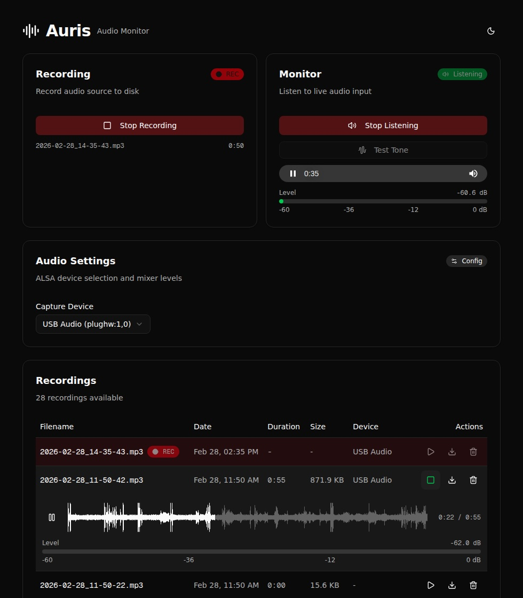

# Auris

Remote audio console for monitoring, recording, and two-way communication. Streams live audio via Icecast2, records to disk (server and client), provides push-to-talk intercom with voice effects, and plays recordings through the server speaker — all controlled through a Next.js web UI.



## Architecture

```
Browser  ──>  Nginx (:80/:443)  ──>  Next.js (:3000)   ── API ──>  systemctl start/stop
                   │                     │                              │
                   │                     │ Auth.js (optional)     auris-stream  auris-record
                   │                     │ SQLite DB              (ALSA→Icecast) (Icecast→file)
                   │                     │ (recording metadata)         │
                   └── /stream/ ───>  Icecast2 (:8000)  <──────────────┘
                                                                        │
                                                                  Audio Source
                                                                 (ALSA capture)
```

- **Next.js** (app router, TypeScript, Tailwind, shadcn/ui, nuqs) — web UI + API routes
- **Auth.js v5** (next-auth) — optional username/password authentication with JWT sessions
- **SQLite** (better-sqlite3, Drizzle ORM) — recording metadata and device info
- **Icecast2** — audio streaming server (localhost only, proxied by Nginx)
- **ffmpeg** — captures ALSA audio for streaming, recording, and server-side playback
- **systemd** — manages capture processes (`auris-stream`, `auris-record` services)
- **Nginx** — reverse proxy under a single hostname
- **PM2** — process manager for the Next.js production server

Two independent systemd services:
- **`auris-stream`**: ALSA → MP3 → Icecast. Runs when user is listening OR recording.
- **`auris-record`**: Reads Icecast stream with `-c copy` (no re-encoding). Only runs when recording.

Toggling recording starts/stops only `auris-record` — the Icecast stream is never interrupted.

Server-side playback uses ffmpeg to decode MP3 recordings directly to the ALSA output device. Talkback and server playback are mutually exclusive — talkback takes priority.

Voice effects (pitch shift, echo, chorus, flanger, vibrato, tempo, autotune) can be applied to both talkback and client recordings. Effects are processed server-side via ffmpeg audio filters. Client recordings store effects metadata in the database for later reference.

## Quick setup

There's an automated setup script that handles everything except Nginx and PM2:

```bash
git clone https://github.com/deviationist/auris.git && cd auris
npm run setup
```

This will:
- Install system packages (`ffmpeg`, `icecast2`)
- Symlink the project to `/opt/auris`
- Create recordings directory and SQLite data directory
- Install `/etc/default/auris` config file
- Set up authentication (optional — leave password empty to skip)
- Generate `AUTH_SECRET` in `.env.local`
- Install Icecast2 config
- Install systemd units and sudoers
- Build the Next.js app

After running the script, follow the printed "Next steps" to configure the ALSA device and start PM2/Nginx.

## Manual setup

### Prerequisites

- Ubuntu 22.04+ (or any systemd-based Linux)
- Node.js 20+ and npm
- A USB microphone (tested with Jabra Speak PHS002W)

```bash
sudo apt update
sudo apt install -y ffmpeg icecast2 nginx
npm install -g pm2
```

### 1. Clone and install

```bash
git clone https://github.com/deviationist/auris.git
cd auris
npm install

# Symlink to /opt/auris (systemd units and PM2 reference this path)
sudo ln -sf "$(pwd)" /opt/auris

# Create recordings directory (or configure RECORDINGS_DIR in .env.local)
sudo mkdir -p /recordings
sudo chown $(whoami):$(whoami) /recordings

# Create SQLite data directory
mkdir -p data
```

### 2. Find your ALSA device

Plug in your USB microphone/input device and identify it:

```bash
arecord -l
```

Example output:
```
card 1: Audio [USB Audio], device 0: USB Audio [USB Audio]
```

This means the device is `plughw:1,0`. You can select it from the web UI (Audio Settings > Capture Device) after setup.

### 3. Configure system

```bash
# Create config file
sudo tee /etc/default/auris > /dev/null <<EOF
ALSA_DEVICE=plughw:1,0
CAPTURE_STREAM=0
CAPTURE_RECORD=0
RECORDINGS_DIR=/recordings
EOF

# Install Icecast config (setup.sh does this automatically with random passwords)
sudo cp system/icecast.xml /etc/icecast2/icecast.xml
sudo systemctl enable icecast2
sudo systemctl restart icecast2
```

Icecast passwords are generated randomly during setup and stored in `/etc/default/auris` (`ICECAST_SOURCE_PASSWORD`). The template in `system/icecast.xml` uses placeholders that `setup.sh` fills in automatically.

### 4. Install systemd units and sudoers

```bash
# Install services
sudo cp system/auris-stream.service /etc/systemd/system/
sudo cp system/auris-record.service /etc/systemd/system/
sudo systemctl daemon-reload

# Install sudoers (setup.sh substitutes %%USER%% automatically)
sudo cp system/auris-sudoers /etc/sudoers.d/auris
sudo chmod 440 /etc/sudoers.d/auris
sudo visudo -c   # must print "parsed OK"
```

### 5. Set up authentication (optional)

Authentication is optional. To enable it:

```bash
npm run auth:set
```

This prompts for a username and password, stores the bcrypt hash in `/etc/default/auris`, and generates `AUTH_SECRET` in `.env.local`. Leave the password empty to disable auth.

When enabled, all routes (GUI, API, `/stream/*`, WebSocket talkback) require login. Sessions last 30 days.

### 6. Build and start with PM2

```bash
npm run build
pm2 start ecosystem.config.js
pm2 save
pm2 startup   # follow the printed command to enable on boot
```

### 7. Configure Nginx (optional)

If you want to access the app via a custom hostname on port 80:

```bash
sudo cp system/nginx-auris.conf /etc/nginx/sites-available/auris
sudo ln -sf /etc/nginx/sites-available/auris /etc/nginx/sites-enabled/
sudo nginx -t
sudo systemctl reload nginx
```

Edit `server_name` in the nginx config to match your hostname, then add it to DNS or `/etc/hosts` on client machines:
```
192.168.x.x  your-hostname
```

Without Nginx, the app is available directly at `http://<server>:3000` (or the port set via `AURIS_PORT`).

### 8. Verify

1. Open the web UI in a browser
2. Click **Start Recording** — the badge should turn red and a REC indicator appears in the recordings table
3. Click **Listen** — you should hear live audio
4. Stop recording, then check the **Recordings** table for duration and size
5. Play or download a recording to verify

## Development

```bash
npm run dev                    # starts Next.js on port 3000 with hot reload
npm run build                  # production build
npm run start                  # production server
npm run stop                   # kill process on port 3000
npm run auth:set               # set or disable auth credentials
npm run db:generate            # generate DB migrations after schema changes
npm run db:push                # push schema directly to DB (dev only)
npm run waveforms:generate     # generate missing waveforms
npm run waveforms:regenerate   # regenerate all waveforms
npm run waveforms:clear        # remove all waveforms from DB
```

The API routes will work in dev mode as long as the systemd unit and sudoers are installed.

## File layout

```
auris/
├── src/
│   ├── auth.ts                         # Auth.js v5 config (Credentials, JWT)
│   ├── proxy.ts                        # Route protection proxy (auth gate)
│   ├── app/
│   │   ├── page.tsx                    # Server component (resolves auth state)
│   │   ├── dashboard.tsx               # Main dashboard UI (client component)
│   │   ├── layout.tsx                  # Root layout (ThemeProvider)
│   │   ├── login/page.tsx              # Login page
│   │   ├── stream/[...path]/route.ts  # Proxies /stream/* to Icecast
│   │   ├── globals.css                 # Tailwind + shadcn/ui theme (light/dark)
│   │   └── api/
│   │       ├── status/route.ts         # GET  — stream/record/playback status
│   │       ├── auth/
│   │       │   ├── [...nextauth]/route.ts  # Auth.js route handler
│   │       │   └── enabled/route.ts    # GET  — check if auth is enabled
│   │       ├── stream/
│   │       │   ├── start/route.ts      # POST — start streaming
│   │       │   ├── stop/route.ts       # POST — stop streaming
│   │       │   └── test-tone/route.ts  # POST — send 440Hz test tone
│   │       ├── record/
│   │       │   ├── start/route.ts      # POST — start recording (inserts DB row)
│   │       │   └── stop/route.ts       # POST — stop recording (updates DB row)
│   │       ├── recordings/
│   │       │   ├── route.ts            # GET  — list recordings from DB
│   │       │   ├── upload/route.ts     # POST — upload client-recorded audio
│   │       │   └── [filename]/
│   │       │       ├── route.ts        # GET  — stream file, PATCH — rename, DELETE — remove
│   │       │       └── waveform/route.ts # GET — waveform peaks data
│   │       ├── talkback/
│   │           │   └── stop/route.ts  # POST — force-stop talkback session
│   │       └── audio/
│   │           ├── devices/route.ts    # GET  — list ALSA capture devices
│   │           ├── device/route.ts     # GET/POST — get/set device selections (record, listen, playback)
│   │           ├── bitrate/route.ts    # GET/POST — stream/record bitrate
│   │           ├── chunk/route.ts      # POST — receive talkback audio chunk
│   │           ├── playback/route.ts   # GET/POST — browser playback device selection
│   │           ├── playback/server/route.ts # GET/POST/DELETE — server-side playback control
│   │           ├── mixer/route.ts      # GET/POST — read/set mixer levels
│   │           └── mixer/all/route.ts  # GET — all mixer controls per card
│   ├── components/
│   │   ├── ui/                         # shadcn/ui components (do not edit)
│   │   ├── login-form.tsx              # Login form (client component)
│   │   ├── level-meter.tsx             # WebAudio RMS/dB level meter (audioElement or analyserNode)
│   │   ├── live-waveform.tsx           # Real-time waveform visualization
│   │   ├── waveform-player.tsx         # Canvas waveform player with seek, play/pause
│   │   ├── card-mixer.tsx              # ALSA mixer card component (capture + playback volume)
│   │   └── theme-provider.tsx          # next-themes wrapper
│   ├── hooks/
│   │   └── use-local-storage.ts       # Generic localStorage hook (SSR-safe)
│   └── lib/
│       ├── utils.ts                    # cn() helper
│       ├── systemctl.ts                # systemctl wrapper
│       ├── alsa.ts                     # ALSA device & mixer operations (capture + playback)
│       ├── device-config.ts            # /etc/default/auris read/write (record, listen, playback devices)
│       ├── auth-config.ts              # /etc/default/auris read (auth credentials)
│       ├── server-playback.ts          # Server-side playback (ffmpeg MP3 → ALSA)
│       ├── talkback.ts                 # Talkback audio (browser PCM → ALSA)
│       ├── talkback-effects.ts         # Voice effects config & ffmpeg filter chain builder
│       ├── waveform.ts                 # Waveform generation (ffmpeg PCM → peaks)
│       └── db/
│           ├── schema.ts               # Drizzle schema (recordings: name, metadata, waveform, etc.)
│           └── index.ts                # DB singleton, migrations, sync
├── scripts/
│   ├── generate-waveforms.mjs          # CLI: generate/clear waveform data in DB
│   └── set-auth.mjs                    # CLI: set/disable auth credentials
├── drizzle/                            # Generated DB migrations
├── data/                               # SQLite database (auris.db)
├── system/
│   ├── auris-stream.service            # systemd: ALSA → Icecast streaming
│   ├── auris-record.service            # systemd: Icecast → file recording
│   ├── auris-sudoers                   # sudoers for passwordless control
│   ├── icecast.xml                     # Icecast2 config
│   └── nginx-auris.conf               # Nginx reverse proxy config
├── stream.sh                           # ffmpeg ALSA → Icecast script
├── record.sh                           # ffmpeg Icecast → file script (-c copy)
├── drizzle.config.ts                   # Drizzle Kit config
├── server.ts                           # Custom HTTP/WebSocket server (talkback WS with auth, Next.js)
├── ecosystem.config.js                 # PM2 config
├── setup.sh                            # Automated setup script
├── .env.example                        # Example environment variables
└── .env.local                          # Environment variables (AUTH_SECRET, etc.)
```

## Configuration

| File | What to change |
|---|---|
| `/etc/default/auris` | `ALSA_DEVICE`, `LISTEN_DEVICE`, `PLAYBACK_DEVICE`, `CAPTURE_STREAM`, `CAPTURE_RECORD`, `RECORDINGS_DIR`, `ICECAST_SOURCE_PASSWORD`, `AUTH_USERNAME`, `AUTH_PASSWORD_HASH` |
| `.env.local` | `RECORDINGS_DIR`, `DATABASE_PATH`, `NEXT_PUBLIC_STREAM_URL`, `AUTH_SECRET`, `AUTH_TRUST_HOST`, `NEXTAUTH_URL` (see `.env.example`) |
| `system/icecast.xml` | Passwords (auto-generated by `setup.sh`), listen address |
| `system/nginx-auris.conf` | `server_name` hostname (default: `_` catch-all) |
| `system/auris-sudoers` | Username (`%%USER%%` placeholder, substituted by `setup.sh`) |

### Authentication

Auth is optional. When `AUTH_USERNAME` and `AUTH_PASSWORD_HASH` are set in `/etc/default/auris`, all routes require login. When omitted, the app runs without authentication.

```bash
npm run auth:set    # interactive: set username/password or disable auth
```

Sessions use JWT tokens (30-day expiry). `AUTH_SECRET` in `.env.local` is required when auth is enabled (generated automatically by `setup.sh` or `auth:set`).

When running behind a reverse proxy, set `NEXTAUTH_URL` in `.env.local` to the external URL (e.g. `https://auris.example.com`) so Auth.js generates correct redirect URLs.
